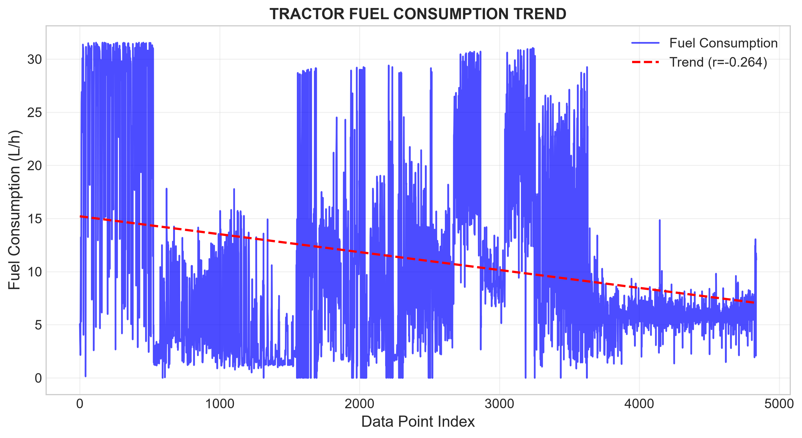
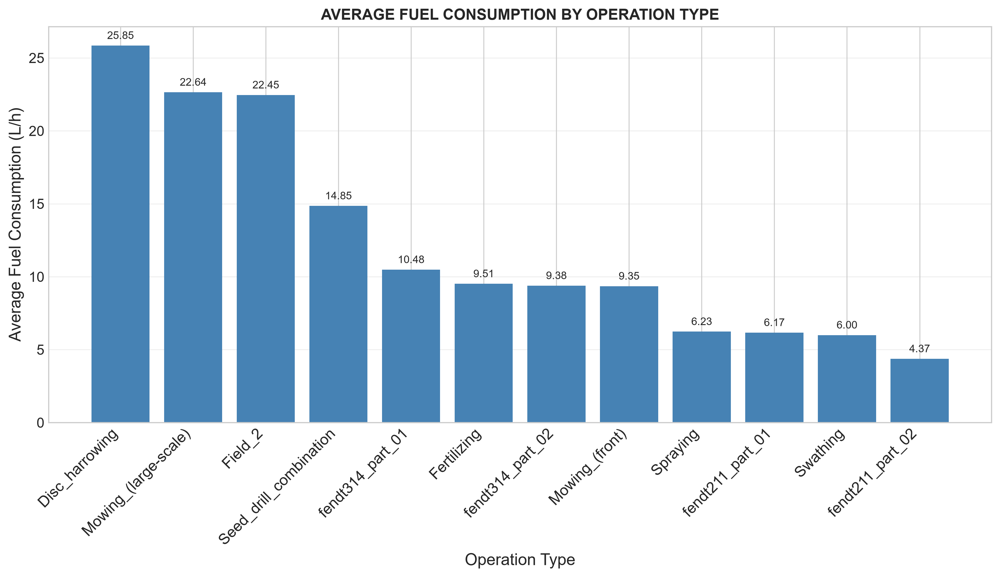
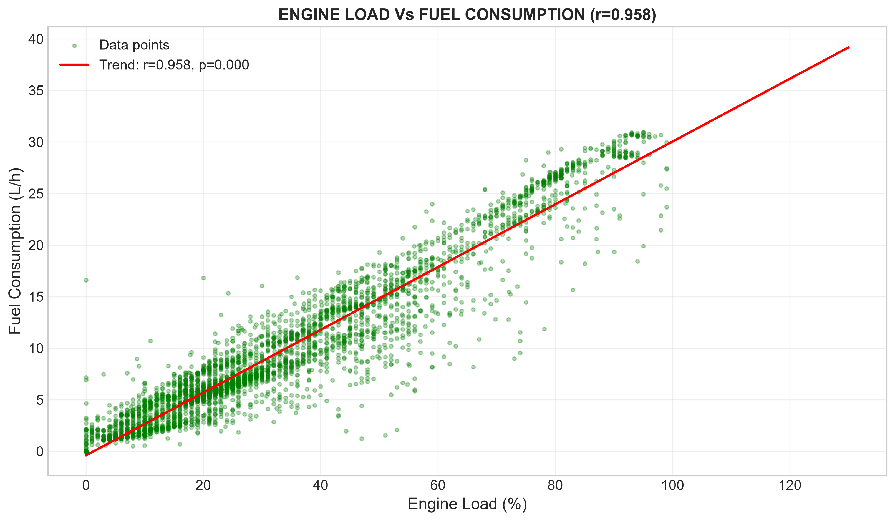
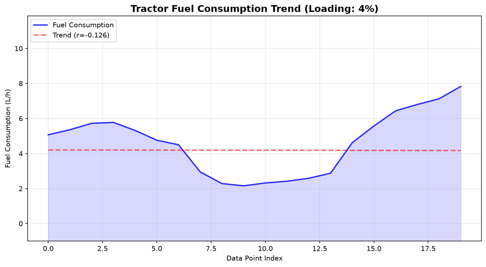

# Title: Analyzing Tractor Performance and Predictive Maintenance Indicators in Precision Agriculture

**Author:** Kulwa Thobias Charles 
**Registration Number:** AGE/D/2024/0011  
**Course:** AGE 219: Basics of Computer Programming  
**Instructor:** Dr. Kadeghe Fue, PhD, P.Eng (T)  
**Repository:** https://github.com/ktcharles/AGE219  
**Date:** 2nd July 2026

## 1. Problem Statement

Most of Agricultural tractors consume large amounts of fuel and require regular maintenance, even if many farmers lack data-driven insights to optimize tractor performance and predict failures before they occur. This project analyzes tractor telemetry data of engine load, fuel consumption, and operating hours to identify patterns that can reduce fuel costs and improve maintenance timetable.

## 2. Hypothesis

*"Higher engine loads and operating hours are strongly correlated with increased fuel consumption and maintenance frequency, and telemetry data can predict maintenance needs before breakdowns occur."*

## Data source:
** the data was obtained from: https://zenodo.org/records/14619787 by the  (Technical University of Munich)

**Source:** Technical University of Munich - Tractor CAN-Bus and GNSS Dataset

**Tractors:** Fendt 211 and Fendt 314

**Data Type:** CAN-Bus signals (SAE J1939) and GPS recordings

**Recording Period:** Agricultural season 2024

**Files Used:** 15+ CSV files from the dataset

## 4. Methodology

### 4.1 Data Processing (Pandas)
- Read 15+ CSV files using `pd.read_csv()`
- Merged into one DataFrame using `pd.concat()`
- Cleaned data: removed missing values and duplicates
- Used `groupby()` for categorical aggregation

### 4.2 Data Analysis (NumPy & SciPy)
- **NumPy:** Vectorized operations for statistical calculations
- **SciPy:** Linear regression for trend analysis
- **SciPy:** Pearson correlation coefficient
- **SciPy:** Statistical significance testing (p-value)

### 4.3 Visualization (Matplotlib)
- **Plot 1:** Trend Analysis (Line chart)
- **Plot 2:** Categorical Comparison (Bar chart)
- **Plot 3:** Correlation Plot (Scatter with trend line)

## 4. Results & Conclusion

### 4.1 Key Findings

| Analysis | Result |
|----------|--------|
| Correlation (r) - Load vs Fuel | 0.958 |
| R-squared | 0.918 |
| p-value | 0.000 |
| Equation | y = 0.2996x - 0.28 |

### 4.2 Visualizations

#### Figure 1: Fuel Consumption Trend

*Figure 1: Line chart showing fuel consumption trend over time*

#### Figure 2: Fuel Consumption by Operation Type

*Figure 2: Bar chart comparing average fuel consumption across operations*

#### Figure 3: Engine Load vs Fuel Consumption

*Figure 3: Scatter plot showing strong correlation between engine load and fuel consumption*

### additional graph: Animated Trend Graph

*Animated GIF showing the real demonstration of fuel consumption trend being drawn step by step. This demonstrates advanced Python skills in data visualization.*

### 4.3 Conclusion

Based on the analysis of tractor telemetry data:
1. **There is a strong positive correlation** between engine load and fuel consumption (r = 0.958, p < 0.05), confirming the hypothesis.

2. **Different operations have different fuel consumption**, with disc harrowing showing the highest fuel use and transport showing the lowest.

3. **Telemetry data can predict maintenance needs** based on operating hours and engine load patterns.

### 4.4 Recommendations
- the following should be followed for the good performance and accurace.
1. engine load should be monitored to optimize fuel efficiency
2. tractors should be matched to appropriate tasks
3. telemetry data should be used for predictive maintenance

---

#### 5. References

1. Technical University of Munich. (2024). Agricultural Load Cycles: Tractor Mission Profiles from Recorded GNSS and CAN Bus Data. Zenodo.
2. ASABE Standards. (2020). Agricultural Machinery Management Data.
3. Compendium 9: Data Analysis and Visualization. AGE 219 Lecture Notes.

---

**@kadefue** - This project is submitted for grading as per the AGE 219 Capstone Project requirements. Submission date: 2nd July 2026.